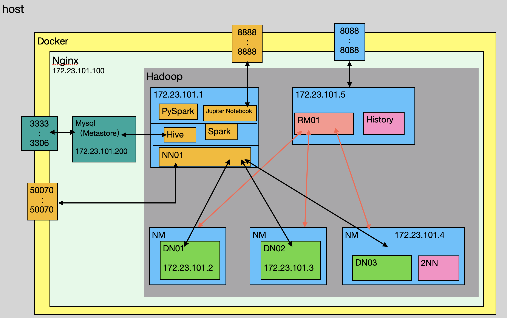

<span id="catalog"></span>

<span style='font-size:18px'>目录<span>

- [镜像编译](#镜像编译)
    - [编译的准备](#编译的准备)
    - [执行镜像编译](#执行镜像编译)
    - [默认的构建顺序](#默认的构建顺序)
- [镜像的entrypoint设置](#镜像的entrypoint设置)
- [compose的设置与操作](#compose的设置与操作)
- [启动默认提供的镜像](#启动默认提供的镜像)
    - [zknode与zookeeper集群](#zknode与zookeeper集群)
    - [普通hadoop集群](#普通hadoop集群)
    - [高可用hadoop集群](#高可用hadoop集群)
    - [hive+普通hadoop集群](#hive+普通hadoop集群)
    - [spark+hive+普通hadoop集群](#spark+hive+普通hadoop集群)
- [默认架构图](#默认架构图)
- [](#)

# 镜像编译
## 编译的准备
[top](#catalog)
1. 需要准备jar，并放在个目录下，包括  <span style='color:red'>TODO--自动分发安装包</span>
    - img/env/zknode
    - img/env/hdnode/hadoop-2.7.2.tar.gz
        - https://mirrors.tuna.tsinghua.edu.cn/apache/hadoop/common/hadoop-2.10.1/hadoop-2.10.1.tar.gz 
    - img/env/jdk8/jdk-8u144-linux-x64.tar.gz
    - img/hdspark/spark-3.0.1-bin-without-hadoop.tgz
        - https://mirrors.tuna.tsinghua.edu.cn/apache/spark/spark-3.0.1/spark-3.0.1-bin-without-hadoop.tgz 
    - img/hive/base/apache-hive-2.3.7-bin.tar.gz
        - https://mirrors.tuna.tsinghua.edu.cn/apache/hive/hive-2.3.7/apache-hive-2.3.7-bin.tar.gz
    - img/hive/base/mysql-connector-java-8.0.19.tar.gz
        - https://downloads.mysql.com/archives/get/p/3/file/mysql-connector-java-8.0.19.tar.gz
2. 需要提前拉取 centos、mysql、nginx的镜像
3. 至少需要 4 G 以上的内存

## 执行镜像编译
[top](#catalog)
```shell
sh bin/build.sh
```

## 默认的构建顺序
[top](#catalog)
- 参考
    - bin/build.sh
- 基础环境部分的构建顺序
    ```
    env/common
    env/ssh
    env/jdk8/
    env/zknode
    env/hanode
    ```
- 其他内容的构建
    - nginx，独立构建
        ```
        hdnginx
        ```
    - hive
        ```
        env/hanode
        hive/base
        ```
    - spark
        ```
        hive/base
        hdspark/hd-hive-spark
        ```

# 镜像的entrypoint设置
[top](#catalog)
- [base.md](base.md)

# compose的设置与操作
[top](#catalog)
- 所有 `compose.yml` 统一保存到 `conf/<composeName>/docker-compose.yml`
- 操作方法
    ```shell
    sh sbin/compose.sh <composeName> up -d
    sh sbin/compose.sh <composeName> ps
    sh sbin/compose.sh <composeName> down
    ```

# 启动默认提供的镜像
## zknode与zookeeper集群
[top](#catalog)
- 镜像 zknode
    - environment

        |环境变量|功能|
        |-|-|
        |`ZOO_MY_ID`|设置 `myid` 中的数值，容器启动后会根据环境变量自动设置<br><span style='color:red'>如果想要容器自动启动zookeeper，必须设置该环境变量</span>|
        |`ZOO_SERVERS`|整个zk集群中的各节点的ip与通信端口<br>该环境变量<span style='color:red'>会覆盖配置文件中的内容</span>|

    - volumes

        |数据卷路径|功能|
        |-|-|
        |`/zkconfig`|zk集群配置文件<br>需要注意不能和 `ZOO_SERVERS` 同时使用，否则会被 `ZOO_SERVERS` 覆盖|

- 启动操作
    - [img/env/zknode/entrypoint/main.sh](img/env/zknode/entrypoint/main.sh)

- 已经包含 zknode 的镜像
    - hanode 及其派生的其他镜像

- 只包含zk集群的启动配置

    |启动配置路径|功能|
    |-|-|
    |[conf/szkcluster/docker-compose.yml](conf/szkcluster/docker-compose.yml)|不使用配置文件的简易集群启动，3 个 节点|
    |[conf/zkcluster/docker-compose.yml](conf/zkcluster/docker-compose.yml)|提供默认的配置文件，通过配置文件来启动集群，3 个 节点|

## 普通hadoop集群
[top](#catalog)
- 集群操作
    ```shell
    sh sbin/compose.sh hdcluster up -d
    sh sbin/compose.sh hdcluster ps
    sh sbin/compose.sh hdcluster down
    ```
- TODO

## 高可用hadoop集群
[top](#catalog)
- 集群操作
    ```shell
    sh sbin/compose.sh hacluster up -d
    sh sbin/compose.sh hacluster ps
    sh sbin/compose.sh hacluster down
    ```
- TODO

## hive+普通hadoop集群
[top](#catalog)
- TODO
- 使用hive之前，需要手动初始化
    ```sh
    schematool -dbType mysql -initSchema
    ```

## spark+hive+普通hadoop集群
[top](#catalog)
- TODO


# 默认架构图
[top](#catalog)
- 


[top](#catalog)


# python部分的编译与启动
1. 需要先编译基础部分
    ```sh
    sh build.sh
    ```
2. 再编译pyspark
    ```sh
    sh buildpy.sh
    ```
3. 启动
    ```sh
    sh clusterpy.sh
    ```

